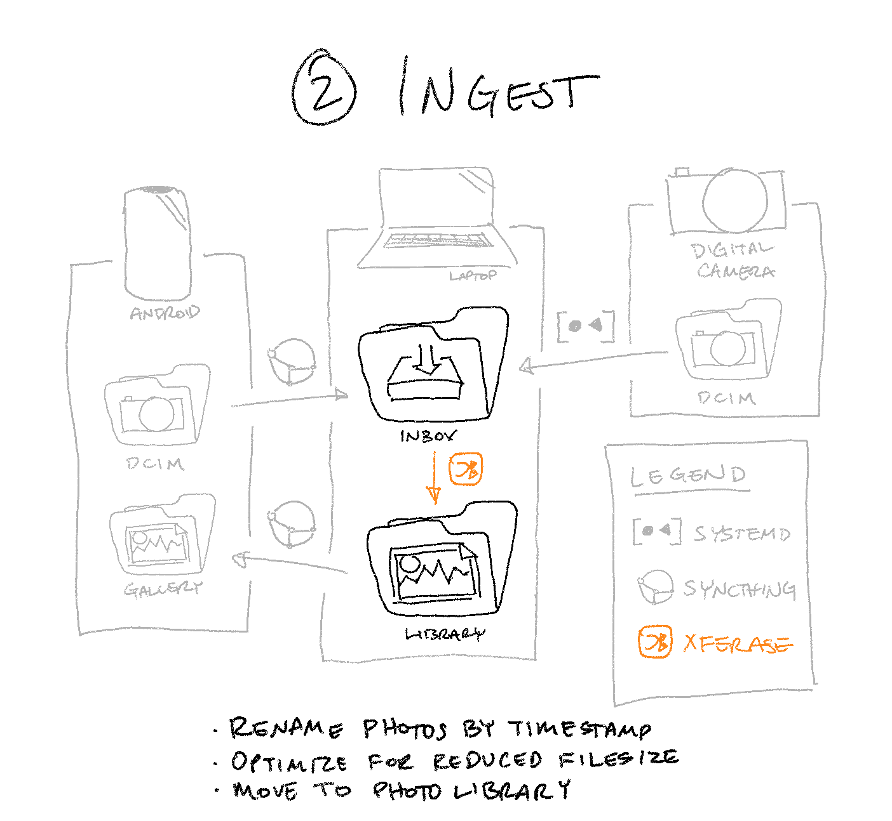

🖼️➡️📂 Rename, optimize, and move new photos into your library
============================================================



Now that you’ve got photos flowing from your phone & camera onto your computer,
it’s time to process them—which is (finally) where Xferase comes in.

Conceptual Overview
-------------------

This guide will cover how to get Xferase installed and running.
By the end of it, every new picture that comes in from your phone or camera
will be automatically imported into your photo library
and renamed according to the time it was taken (or downloaded).

Xferase may be run in a Docker container
or installed via RubyGems and run as a systemd service.
Both approaches will work, so choose whichever one is more familiar to you.

Option 1: Docker
----------------

> 🤔 **What is the `TZ` env var for?**
>
> Typically, video files store their metadata timestamps in UTC.
> Xferase needs to know the system time zone
> to make them consistent with your photos’ timestamps.

### Option 1a: on the CLI

```sh
$ docker run -d \
    --name xferase \
    --user $(id -u) \
    --env TZ=$(timedatectl show --property=Timezone --value) \
    --volume $HOME/Pictures:/data \
    --env INBOX=/data/.inbox \
    --env STAGING=/data/.staging \
    --env LIBRARY=/data/master \
    --env LIBRARY_WEB=/data/web \
    rlue/xferase
```

### Option 1b: with Docker Compose

```yaml
# docker-compose.yml

version: '3'

services:
  image: rlue/xferase:latest
  user: 1000  # or whatever the value of `id -u` is
  volumes:
    - ${HOME}/Pictures:/data
  environment:
    TZ: America/Los_Angeles  # or whatever the value of `timedatectl show --property=Timezone --value` is
    INBOX: /data/.inbox
    STAGING: /data/.staging
    LIBRARY: /data/master
    LIBRARY_WEB: /data/web
  restart: unless-stopped
```

Option 2: RubyGems + systemd
----------------------------

1. Install the gem & external dependencies

   ```sh
   # Requires Ruby 2.6+
   $ gem install xferase

   # Debian / Ubuntu
   $ sudo apt install libimage-exiftool-perl mediainfo imagemagick optipng ffmpeg

   # Fedora / CentOS
   $ sudo yum install perl-Image-ExifTool mediainfo ImageMagick optipng ffmpeg

   # ArchLinux
   $ sudo pacman -S perl-image-exiftool mediainfo imagemagick optipng ffmpeg
   ```

2. Create a user-level systemd service for it

   ```sh
   # Create the service file
   $ mkdir -p ~/.local/share/systemd/user
   $ vim ~/.local/share/systemd/user/xferase.service

       [Unit]
       Description=Photo/video import daemon

       [Service]
       ExecStart=xferase \  # Using rbenv or rvm? Use `rbenv exec xferase` or `rvm-exec xferase` instead
         --inbox=$HOME/Pictures/.inbox \
         --staging=$HOME/Pictures/.staging \
         --library=$HOME/Pictures/master \
         --library-web=$HOME/Pictures/web
       Restart=on-failure

       [Install]
       WantedBy=default.target
   
   # Reload to pick up your changes
   $ systemctl --user daemon-reload

   # Launch the service
   $ systemctl --user start xferase

   # “Install” it to launch automatically each time you log in
   $ systemctl --user enable xferase
   ```

That’s it!
Test it out by dropping a photo into the inbox; separate copies should show up
in your master and web-optimized libraries moments later. 🥂
