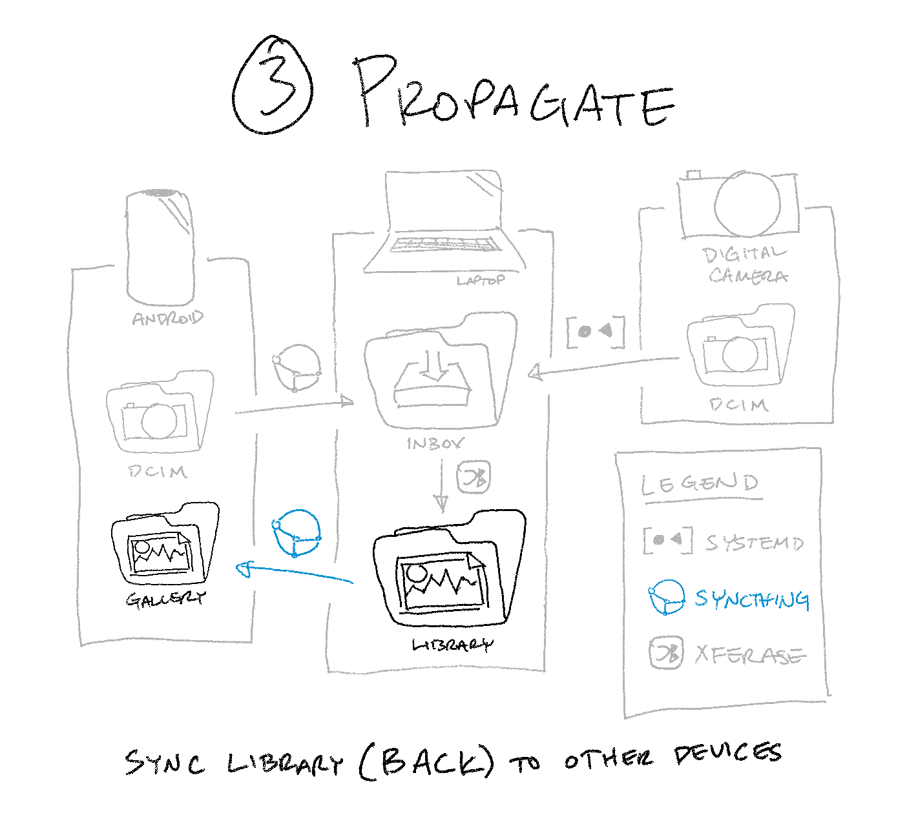

🖥️🔄📱 Sync your library (back) to other devices
===============================================

Conceptual Overview
-------------------

In previous guides,
we automated [getting photos _off of_ a phone and into Xferase’s inbox][].
At that point, the originals are removed from your phone;
this guide will help you put them back.

Just like before, we’ll use Syncthing
to mirror files between your phone and your computer—only this time,
it’ll be your photo library instead of your phone’s DCIM folder.

> ☝️ **But my photo library is too big to fit on my phone!**
>
> Yep—that’s why we ran Xferase with the [`--library-web` option][]
> in the previous guide.
>
> For the web-optimized library, Xferase downscales
> all photos to ≤2 megapixels and videos to ~4Mbps.
> My personal collection of 5,000+ photos and videos weighs in at 4GB;
> if your library still won’t fit on your phone with that kind of compression,
> you either need to delete some photos or get a new phone.
>
> [`--library-web` option]: ../README.md#option---library-web

[getting photos _off of_ a phone and into Xferase’s inbox]: upload-phone.md

Step 1: Install & Set Up Syncthing
----------------------------------

You should have already done this in [the _Upload_ guide][],
but the directions are copied here for your convenience:

> Follow Syncthing’s official [Getting Started guide][]
> to get it installed and link your devices to each other.
>
> When you’re done,
> you should see your computer in your phone’s Syncthing device list
> (and vice versa):
>
> 
>
> [Getting Started guide]: https://docs.syncthing.net/intro/getting-started.html

[the _Upload_ guide]: upload-phone.md#step-1-install-syncthing--add-devices

Step 2: Add & Accept Folders
----------------------------

Access Syncthing’s web UI on your computer
(default <https://localhost:8384>)
and create a folder for your web-optimized photo library.
Make sure to share it with your phone:

Then, open Syncthing on your phone and accept the newly shared directory.
You can configure it to sync to any folder on your phone;
I prefer `/Pictures/library`:

_Use the Android notifications menu to accept the new folder invitation._

Congratulations! You made it to the end.
Your DIY cloud photo system is live;
go take some photos and have fun with it! ❦
