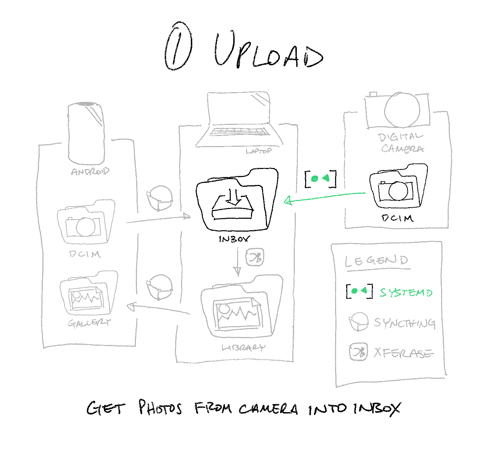

📷➡️🖥️ Get photos from your camera into Xferase’s inbox
=====================================================

> 💡 **Caveat:** If you have some familiarity with Linux system administration,
> this guide should be very straightforward.
> If not, don’t expect to get through it without learning a thing or two.



Traditionally, getting photos off of a digital camera is a tedious process.
_Remove the SD card, plug it in, copy the files to disk,
eject the volume, put the SD card back in the camera_—not
an easy thing for a busy person to do every time they take some photos.

We can’t automate _all_ of these steps away, but with this guide,
you can at least eliminate the mouse/keyboard interaction:
_remove the SD card, plug it in, let it run, put it back._

(There are, of course, other ways to do something similar—either
using photo management software or with a Wi-Fi/Bluetooth-enabled camera—but
this is what works best for me.)

Conceptual Overview
-------------------

In broad strokes, we will set up a **user-level systemd service**
that waits for the camera or SD card to be attached
before mounting it, moving its contents to Xferase’s inbox, and unmounting it.

Because this is a user-level service,
we need to **add an fstab entry for the camera or SD card**
so that it can be mounted by a regular user (_i.e.,_ without `sudo`).

If all of that made sense to you, skip ahead to [Step 1][] below.
If not, here are some questions you might be asking yourself right now:

[Step 1]: #step-1-allow-regular-users-to-mount-the-camera-via-fstab

> #### 🤔 **Where do I find Xferase’s inbox?**
>
> It’s wherever you want it to be;
> Xferase has no default inbox path,
> and can watch any directory you tell it to.
> (I personally prefer `~/Pictures/.inbox`).
>
> #### 🤔 **What is systemd?**
>
> _systemd_ is a Linux background service manager (among other things)
> that coordinates when processes should be stopped, started, or restarted.
>
> It’s what bootstraps the whole system during startup.
> You know that stream of console output that comes up
> just before you see the login screen?
>
> ```
> [  OK  ] Started Accounts Service.
> [  OK  ] Reached target Network.
>          Starting Modem Manager...
>          Starting Network Manager Wait Online...
>          Starting Save/Restore Sound Card State...
>          Starting containerd container runtime...
>          Starting OpenBSD Secure Shell server...
>          Starting Permit User Sessions...
> [  OK  ] Started Unattended Upgrades Shutdown.
>          Starting Hostname Service...
> [  OK  ] Finished Permit User Sessions.
>          Starting Hold until boot process finishes up...
>          Starting Terminate Plymouth Boot Screen...
> [  OK  ] Started Simple Desktop Display Manager.
> ```
>
> That’s systemd, and it doesn’t stop there.
> Systemd is running all the time, in the background, from bootup to shutdown.
>
> You can register your own custom services for systemd to manage.
> Our custom service will run once every time a specified device is connected.
>
> See `man systemd` to learn more.
>
> #### 🤔 **What is a “user-level” service?**
>
> Most systemd units are “system-level”, meaning that they are run as root.
> As you might expect, user-level units are run as the user they belong to.
>
> See `man systemd.unit` to learn more.
>
> #### 🤔 **Why do we need a user-level service?**
>
> We are going to write a custom service
> to copy files from one place to another.
> We can’t use a system-level service because if we did,
> the resulting files (_i.e.,_ our personal photo library)
> would be owned by `root`. 🙅
>
> #### 🤔 **What is fstab?**
>
> _fstab_ (short for “filesystem table”) is a system configuration file
> detailing rules for how to mount individual storage devices.
> We will use it to hardcode a rule
> allowing regular users to mount your camera’s SD card,
> along with specifying what directory it should be mounted to:
>
> ```sh
> # Instead of this...
> $ sudo mount /dev/sdc1 /media/camera
>
> # ...you’ll be able to do this
> $ mount /media/camera
> ```
>
> See `man fstab` to learn more.
>
> #### 🤔 What does it mean to “mount” my SD card? What is a “regular user”? What is `sudo`?
>
> This guide may be too advanced for you.
> If you’re just getting started with Linux,
> work your way through [LinuxCommand.org][] and its associated book
> before gettin’ all fancy with stuff like this.
>
> [LinuxCommand.org]: http://linuxcommand.org

Step 1: Allow regular users to mount the camera (via fstab)
-----------------------------------------------------------

> ⚠️ **Note**
>
> The examples below are taken from the author’s own system and camera;
> modify as appropriate.

```sh
# Create a permanent mount point
$ sudo mkdir /media/ricoh_gr

# Plug your camera into USB, then find its LABEL or UUID
$ sudo blkid
/dev/sda1: UUID="9d5c5dfb-87d9-0dc7-ab96-658bf52e93bf" TYPE="ext4" PARTUUID="7bcbc41d-cfff-874c-a825-e9041357d15e"
/dev/sdb1: UUID="6364-D4D0" TYPE="vfat" PARTUUID="7568cf1f-66b6-4875-9f0e-31be907c3bda"
/dev/sdb2: UUID="dec5c1ad-b8cb-4c2f-c798-e169d11fc29e" TYPE="ext4" PARTUUID="e3f86e17-96a7-4eec-ba49-83a7a0cd1a2e"
/dev/sdb3: UUID="b82f560b-db77-424c-8aa3-9ee5bc78ccd4" TYPE="swap" PARTUUID="8d4cf864-4350-4b26-8af6-70786ae3e729"
/dev/sdc1: LABEL_FATBOOT="RICOH_GR" LABEL="RICOH_GR" TYPE="vfat"
                                         # ⬆️ There it is!

# Add an entry for it to your /etc/fstab
$ sudo -e /etc/fstab

    # <file system>		<mount point>	<type>	<options>		<dump>	<pass>
    LABEL=RICOH_GR		/media/ricoh_gr	vfat	defaults,noauto,user	0	2

# Verify that it works 🎉🎉🎉
$ mount /media/ricoh_gr
```

Step 2: Create your systemd service
-----------------------------------

> ⚠️ **Note**
>
> The examples below are taken from the author’s own system and camera;
> modify as appropriate.

```sh
# Find the name for your camera’s systemd device unit by label or UUID
$ systemctl --all --full --type=device | grep -E '(label|uuid)' | awk '{print $1}'
dev-disk-by\x2dpartuuid-7568cf1f\x2d66b6\x2d4875\x2d9f0e\x2d31be907c3bda.device
dev-disk-by\x2dpartuuid-7bcbc41d\x2dcfff\x2d874c\x2da825\x2de9041357d15e.device
dev-disk-by\x2dpartuuid-8d4cf864\x2d4350\x2d4b26\x2d8af6\x2d70786ae3e729.device
dev-disk-by\x2dpartuuid-e3f86e17\x2d96a7\x2d4eec\x2dba49\x2d83a7a0cd1a2e.device
dev-disk-by\x2duuid-6364\x2dD4D0.device
dev-disk-by\x2duuid-9d5c5dfb\x2d87d9\x2d0dc7\x2dab96\x2d658bf52e93bf.device
dev-disk-by\x2duuid-b82f560b\x2ddb77\x2d424c\x2d8aa3\x2d9ee5bc78ccd4.device
dev-disk-by\x2duuid-dec5c1ad\x2db8cb\x2d4c2f\x2dc798\x2de169d11fc29e.device
dev-disk-by\x2dlabel-RICOH_GR.device # ⬅️ There it is!

# Create the service file
$ mkdir -p ~/.local/share/systemd/user
$ vim ~/.local/share/systemd/user/dcim-transfer.service

    [Unit]
    Description=Digital Photo Transfer for Ricoh GR
    BindsTo=dev-disk-by\x2dlabel-RICOH_GR.device
    After=dev-disk-by\x2dlabel-RICOH_GR.device

    [Service]
    ExecStart=/bin/sh -c 'mount /media/ricoh_gr && find /media/ricoh_gr/DCIM -type f -exec mv -t /path/to/xferase/inbox "{}" + && find /media/ricoh_gr/DCIM/ -type d | tac | xargs rmdir --ignore-fail-on-non-empty "{}" + && umount /media/ricoh_gr'
    Restart=no

    [Install]
    WantedBy=dev-disk-by\x2dlabel-RICOH_GR.device

# Reload to pick up your changes
$ systemctl --user daemon-reload

# Take a photo, plug in your camera, and run manually verify that it works
$ systemctl --user start dcim-transfer

# “Install” it to run automatically each time your camera is plugged in 🎉🎉🎉
$ systemctl --user enable dcim-transfer
```

> 🤔 **Note:** Why do we use `find -exec mv ...` and not `mv ...`?
>
> Xferase watches for changes in the inbox using inotify.
> inotify cannot watch directories recursively,
> so new files have to be placed inside the inbox directly.

Now, you should be able to
take some photos, plug in your camera, and just walk away—and
the photos should automatically appear in Xferase’s inbox. 🥂
