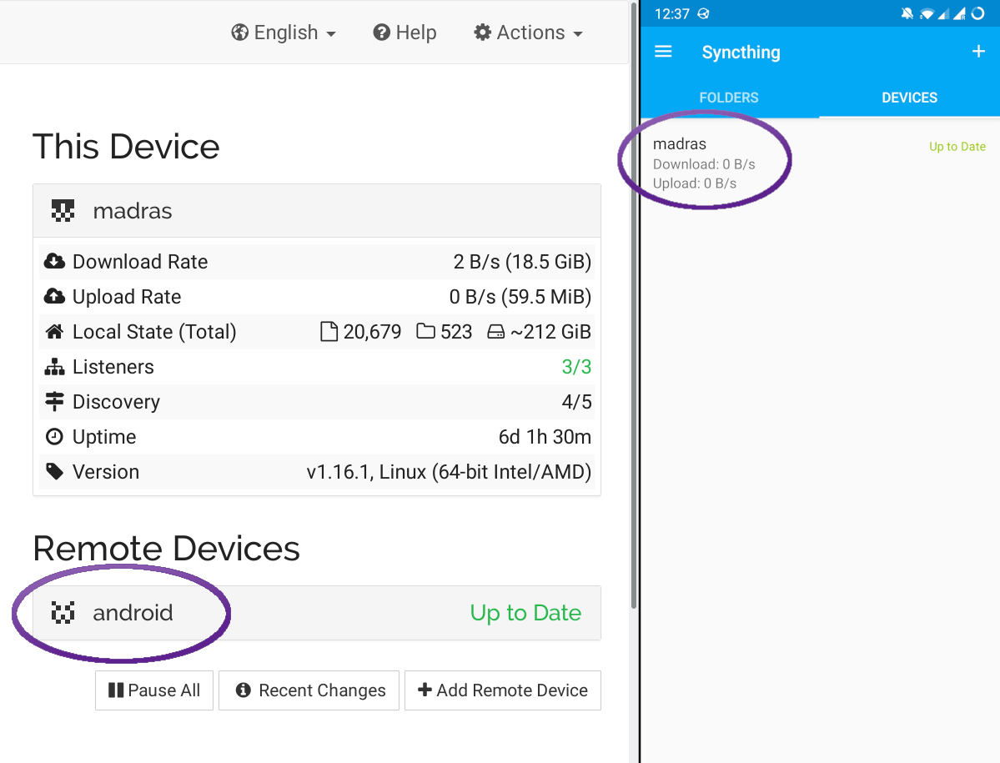

📷➡️🖥️ Get photos from your phone into Xferase’s inbox
====================================================

Conceptual Overview
-------------------

The best way to sync files between your phone and your computer
is with a file sync utility called Syncthing ([Desktop][] | [Android][]).

By the end of this guide,
you’ll have two new subdirectories in your Xferase inbox:
one synced to your Android’s DCIM folder (for photos you take)
and the other to its Pictures folder (for photos you save from chat apps).

[Desktop]: https://syncthing.net
[Android]: https://play.google.com/store/apps/details?id=com.nutomic.syncthingandroid

Before we get started,
here are some questions you might be asking yourself right now:

> #### 🤔 Where do I find Xferase’s inbox?
>
> It’s wherever you want it to be;
> Xferase has no default inbox path,
> and can watch any directory you tell it to.
> (I personally prefer `~/Pictures/.inbox`).
>
> #### 🤔 What about iPhone?
>
> I don’t believe this setup is possible with an iPhone:
>
> * Our goal is to set up **two-way** file sync
>   (not only do photos taken on your phone appear on your computer, but
>   _photos deleted from your computer are removed from your phone,_ as well).
>
> * In the iOS security model,
>   applications are sandboxed and given **limited access to the filesystem**.
>   File sync apps like Dropbox can _read_ from your camera roll,
>   but they can’t _delete_ from it.
>
> #### 🤔 What about Dropbox?
>
> Syncthing is like Dropbox on steroids (and it’s FOSS, to boot).
> Dropbox only syncs a single master directory (at `/home/user/Dropbox`),
> whereas Syncthing lets you do things like:
>
> * specify _which directory_ you want to sync
> * sync _multiple directories_
> * sync _different sets of directories_ to different devices
> * define _filename patterns to ignore_ when syncing (like in a `.gitignore`)
>
> 
>
> _Syncthing on desktop (left) and mobile (right),
> with three folders shared between them._

Step 1: Install Syncthing & Add Devices
---------------------------------------

Follow Syncthing’s official [Getting Started guide][]
to get it installed and link your devices to each other.

When you’re done,
you should see your computer in your phone’s Syncthing device list
(and vice versa):

[Getting Started guide]: https://docs.syncthing.net/intro/getting-started.html

Step 2: Add & Accept Folders
----------------------------

Open Syncthing on your phone and create a folder for your DCIM directory.
Make sure to share it with your computer (in this case, `madras`):

Then, access Syncthing’s web UI on your computer
(default <https://localhost:8384>)
and accept the newly shared directory.
Configure it to sync to a subdirectory of your Xferase inbox:

Repeat this process for any other directories on your phone
that you’d like to auto-import from
(_e.g.,_ `/Pictures/Telegram`, `/Pictures/Instagram`, etc.).

> ⚠️ **Warning: Don’t sync the whole `/Pictures` directory**
>
> Otherwise, you may end up with a recursively-syncing,
> circular-dependency scenario in [the final step][].
>
> (There are ways to get around this using [ignore patterns][] in Syncthing,
> but that’s beyond the scope of this guide.)
>
> [the final step]: propagate.md#step-2-add--accept-folders
> [ignore patterns]: https://docs.syncthing.net/users/ignoring.html

That’s all there is to it! 🥂
